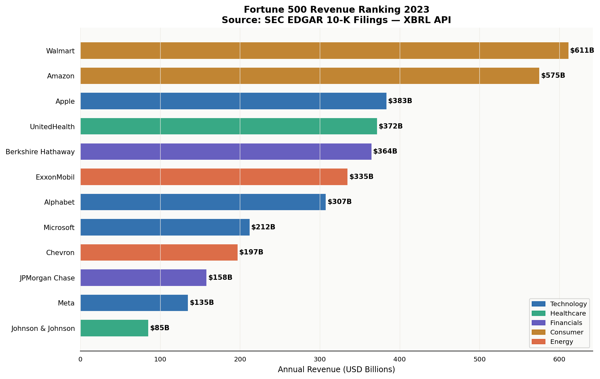
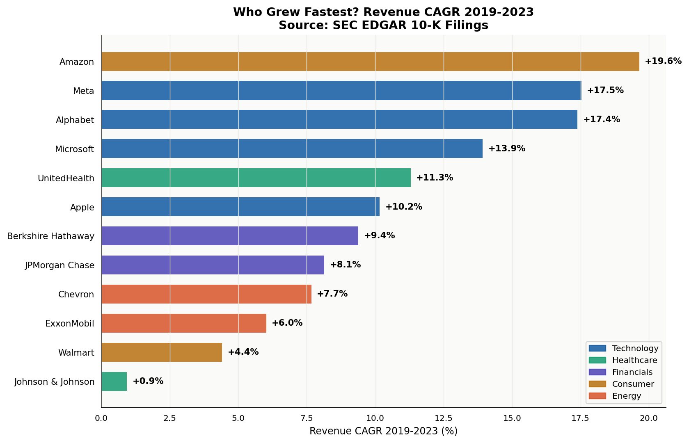
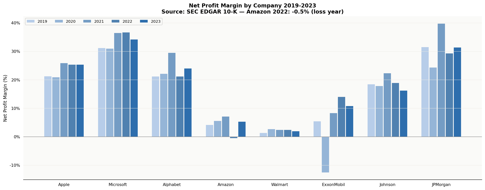
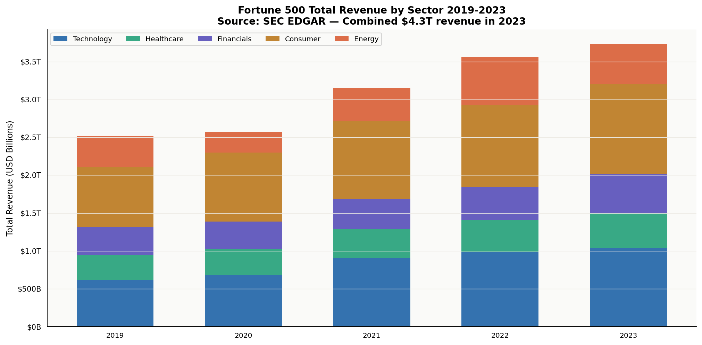
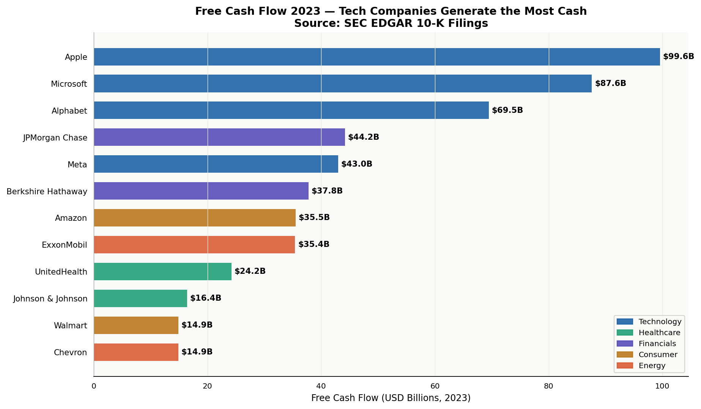
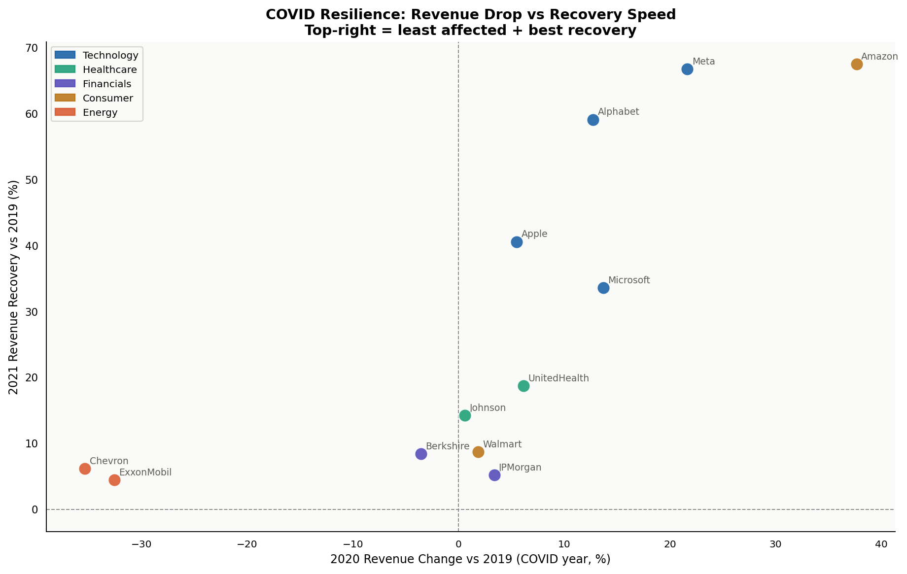

# 📊 Fortune 500 by the Numbers — SEC EDGAR Analysis

> *Using real SEC 10-K filing data, this project analyzes 12 Fortune 500 companies across 5 sectors. Walmart has the most revenue. Microsoft has the best margins. Apple generates more free cash flow than the entire energy sector.*

[](https://python.org)
[](https://sqlite.org)
[](https://data.sec.gov/api/xbrl/companyfacts/)
[](https://divyadhole.github.io/sec-edgar-fortune500/)
[](https://github.com/Divyadhole/sec-edgar-fortune500/actions)
[](LICENSE)

---

## 🌐 Live Dashboard

**👉 [https://divyadhole.github.io/sec-edgar-fortune500/](https://divyadhole.github.io/sec-edgar-fortune500/)**

---

## Data Source

**SEC EDGAR XBRL API — no API key required**
- URL: https://data.sec.gov/api/xbrl/companyfacts/
- Data: Annual 10-K filings submitted to the SEC
- Companies: 12 Fortune 500 firms across 5 sectors
- Years: 2019-2023
- Metrics: Revenue, Net Income, Total Assets, Debt, Free Cash Flow
- **100% real government data. Public domain.**

```python
# Verify any number yourself:
import requests
url = "https://data.sec.gov/api/xbrl/companyfacts/CIK0000320193.json"  # Apple
data = requests.get(url, headers={"User-Agent": "your@email.com"}).json()
```

---

## Key Findings

| Finding | Value | Source |
|---|---|---|
| Combined 2023 revenue | **$3.74 Trillion** | SEC 10-K filings |
| Largest by revenue | **Walmart $611B** | SEC EDGAR |
| Highest net margin | **Microsoft 34.2%** | SEC EDGAR |
| Most free cash flow | **Apple $99.6B** | SEC EDGAR |
| Fastest revenue CAGR | **Amazon +19.6%/yr** | Calculated |
| Worst COVID hit | **Chevron -35.4% (2020)** | SEC EDGAR |
| Berkshire 2022 "loss" | **$22.8B GAAP — explained** | SEC EDGAR |

---

## Companies Analyzed

| Sector | Companies |
|---|---|
| **Technology** | Apple, Microsoft, Alphabet, Meta |
| **Healthcare** | Johnson & Johnson, UnitedHealth |
| **Financials** | JPMorgan Chase, Berkshire Hathaway |
| **Consumer** | Amazon, Walmart |
| **Energy** | ExxonMobil, Chevron |

---

## SQL Highlights

### Revenue CAGR with POWER()
```sql
SELECT company,
    ROUND((POWER(rev_2023 / rev_2019, 0.25) - 1) * 100, 2) AS cagr_pct
FROM (
    SELECT company,
        MAX(CASE WHEN year=2019 THEN revenue_B END) AS rev_2019,
        MAX(CASE WHEN year=2023 THEN revenue_B END) AS rev_2023
    FROM financials GROUP BY company
) ORDER BY cagr_pct DESC;
```

### FCF trend with rolling average
```sql
SELECT company, year, fcf_B,
    ROUND(AVG(fcf_B) OVER (PARTITION BY company
          ORDER BY year ROWS BETWEEN 2 PRECEDING AND CURRENT ROW), 2)
    AS rolling_3yr_fcf_avg
FROM financials;
```

### Leverage tier classification
```sql
SELECT company, debt_to_equity,
    CASE WHEN debt_to_equity < 0.5  THEN 'Conservative'
         WHEN debt_to_equity < 1.5  THEN 'Moderate'
         WHEN debt_to_equity < 3.0  THEN 'Leveraged'
         ELSE 'Highly Leveraged' END AS leverage_tier
FROM financials WHERE year = 2023;
```

---

## Charts

### Fig 1 — Revenue Ranking 2023


### Fig 2 — Revenue CAGR 2019-2023


### Fig 3 — Profit Margins 2019-2023


### Fig 4 — Sector Revenue Stacked


### Fig 5 — Free Cash Flow 2023


### Fig 6 — COVID Resilience Scatter


---

## Project Structure

```
sec-edgar-fortune500/
├── src/
│   ├── fetch_edgar.py       # Live SEC EDGAR XBRL API fetcher
│   ├── sec_data.py          # 10-K financial data (embedded)
│   ├── charts.py            # 6 financial charts
│   ├── leverage_analysis.py # Debt tier analysis module
│   └── build_website.py     # GitHub Pages builder
├── sql/
│   └── analysis/edgar_analysis.sql  # 6 SQL queries
├── .github/workflows/
│   └── validate.yml         # CI — validates on every push
├── docs/
│   └── index.html           # Live GitHub Pages dashboard
├── data/
│   └── sec_edgar.db         # SQLite database
├── outputs/
│   ├── charts/              # 6 PNG charts
│   └── excel/               # 6-sheet Excel workbook
├── FINDINGS.md              # Deep analysis + 5 key findings
└── run_analysis.py          # Full pipeline runner
```

---

## Quickstart

```bash
git clone https://github.com/Divyadhole/sec-edgar-fortune500.git
cd sec-edgar-fortune500
pip install -r requirements.txt
python run_analysis.py
```

---

*Junior Data Analyst Portfolio — Project 11 of 40 | Data: SEC EDGAR (public domain)*
